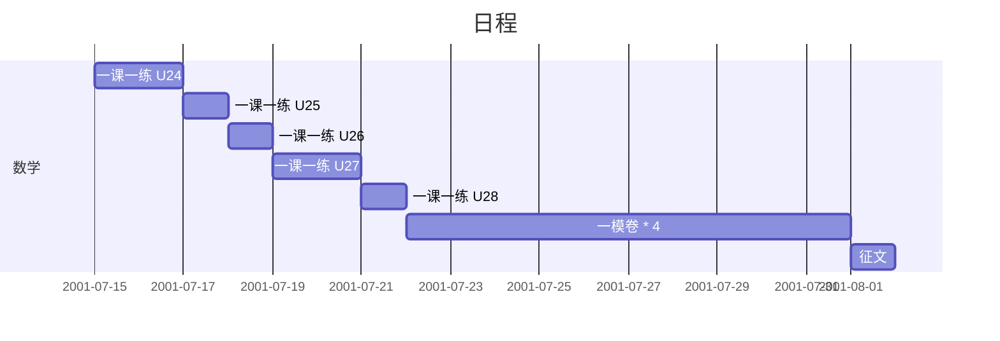

2020 暑假作业计划
===

总量
---

- 语文
  - 作文 \* 2
    - 征文《云上的文化之旅》/《黄浦江畔的思考》
    - 观后感 / 读后感
  - 默写文言诗文 \* 14 \* 1 遍
  - 练习纸
- 数学
  - 一课一练 \* 5 单元
  - 一模卷 \* 17 + 17 + 14
- 英语
  - 考纲词汇
    - 学习背诵《手册》
    - 做《双向默写练习》
  - 一模卷 

计划
---

